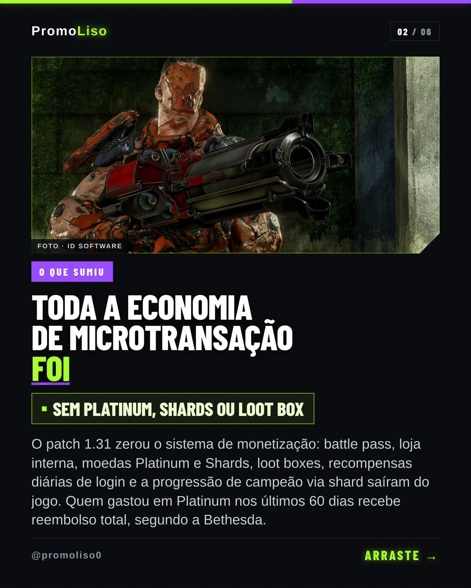

# PromoLiso — pipeline autônomo de conteúdo para Instagram

[](https://github.com/ZeMagao/promoliso-pipeline/actions/workflows/harness.yml)

Um sistema que lê 12 feeds de games e tech, escolhe a pauta, escreve o texto, renderiza o
carrossel e publica no Instagram sozinho, todo dia, sem ninguém apertar botão. Roda em n8n
self-hosted num VPS, com serviços auxiliares em Node.

**Estado em 24/09/2026:** 4 workflows ativos, 67 peças publicadas, **2 a 3 posts por dia** nos
últimos 8 dias, 28 rodadas do produtor seguidas sem erro depois do último conserto.

> Este repositório é o registro de **como** o sistema é mudado, não só do que ele é. Cada
> alteração em produção entrou como um patch versionado com prova offline — 50 patches, 41
> harnesses. A parte mais útil para quem avalia está em [docs/METODO.md](docs/METODO.md) e nos
> arquivos de `design/`, onde o cabeçalho de cada patch conta a medição que motivou a mudança.

**O que ele publicou, sem ninguém no meio.** Capa e segundo slide de um carrossel real, gerados,
renderizados e postados pelo pipeline — texto, foto, crédito e paginação incluídos:

<p align="center">
  
  
</p>

Últimas peças na conta [@promoliso0](https://www.instagram.com/promoliso0/):

| post | pauta |
|---|---|
| [24/09](https://www.instagram.com/p/DdrNi09CPFm/) | Quake Champions deixa o free-to-play |
| [23/09](https://www.instagram.com/p/Ddpfss6iIWy/) | Age of Empires II recebe os vikings |
| [23/09](https://www.instagram.com/p/DdpENjMiPR6/) | Frozen Trail, a maior atualização do ano em Arc Raiders |

---

## Prove em 2 minutos, sem instalar nada

```bash
npm test          # 8/8 verdes — só Node, sem npm install, sem acesso ao servidor
```

Isso roda os harnesses **vivos**: eles carregam o código real dos nós (exportado do banco do n8n
para `workflows/`), executam esse código num mini-ambiente que imita o n8n e comparam o
comportamento antes e depois de cada patch. Nenhum deles usa mock do que está sendo testado.

```bash
npm run test:mapa     # o mapa completo: 8 vivos · 23 provas de época · 10 que exigem o VPS
```

A distinção é deliberada e está explicada em [tools/harness.cjs](tools/harness.cjs): um harness
escrito para provar uma mudança específica **envelhece** quando um patch posterior mexe no mesmo
nó. Chamar isso de regressão seria mentir sobre o que ficou vermelho. Os vivos são os que precisam
ficar verdes — eles detectam se o patch já está aplicado e montam o "antes" revertendo o que está
no ar, então passam nos dois estados.

---

## Como uma mudança entra em produção

Não existe editar workflow na interface e torcer. O caminho é:

```
medir o problema  →  escrever o patch  →  harness offline  →  --dry  →  deploy-vps.sh  →  exportar de volta
   (com dados         (troca por âncora,   (roda o nó real,   (valida     (backup, para o     (o repo passa a
    reais, não         idempotente,         antes × depois)    sem          n8n, aplica,        refletir o que
    suposição)         com --reverter)                         gravar)      religa, confere)    roda de verdade)
```

- **Patch**: `design/patch_*.cjs`. Acha uma âncora exata no `jsCode` do nó e troca o trecho. Se a
  âncora aparecer 0 ou 2 vezes, ele **aborta** — não aplica pela metade. Todo patch tem
  `--reverter`, e os harnesses provam que ida e volta devolvem o byte original.
- **Deploy**: [deploy-vps.sh](deploy-vps.sh) faz backup, roda o dry-run, para o n8n (não se patcha
  banco aberto), aplica, religa, espera o `healthz` e confere que os 4 workflows reativaram com
  `draft == publicado`.
- **Export**: [export-workflows.cjs](export-workflows.cjs) despeja do banco para `workflows/` o
  `jsCode` de cada nó e os prompts. Sem isso não existe diff do que está rodando — e o repo
  mentiria sobre produção.

Detalhes, armadilhas e o que já custou caro: [docs/METODO.md](docs/METODO.md).

---

## Três casos que mostram o método

### 1. A medição que matou a minha própria hipótese

O Instagram parou de publicar. A causa aparente: o buscador do Meta falhava ao baixar as imagens
do Cloudinary — medido 3/8 e 3/6 ali, contra 8/8 num host fora. Conclusão óbvia: trocar de host.

No dia seguinte refiz a medição **pareada, no mesmo minuto**: 17/18 dos dois lados. Empate. A
medição anterior comparava um host ruim num intervalo ruim com um host de controle medido em
**outro horário** — confundia host com relógio. O conserto continuou no ar (ele traz log de quem
pediu o quê, que é o que faltava), mas com a conclusão corrigida no commit e na documentação.

> `design/patch_cdn_publicador.cjs` · `vps/cdn/promo-cdn.cjs`

### 2. Não faltava matéria: o tema perdia por acaso

Pedido: "Game Pass e PS Plus têm que sair todo mês". A resposta fácil seria adicionar feeds.
Medi 1549 títulos reais da tabela de curadoria: **32 itens do tema chegaram ao Curador, quase
todos com nota ≥ 78, e só 3 viraram post**. O tema não faltava — ele competia em três funis
seguidos (24 candidatos → 5 do Curador → 1 pauta por rodada) e perder três sorteios é o normal.

O conserto reserva vaga nos dois cortes e dá bônus no desempate, e **tudo isso se desliga sozinho**
quando o mês já tem o post. Classificador validado contra gabarito à mão: 32/32, zero falso
positivo em 1549 títulos.

> `design/patch_pauta_calendario.cjs` · `design/test_pauta_calendario.cjs`

### 3. O alarme nunca falhou — o canal falhou

A conta ficou 23 dias sem publicar. O watchdog detectou **todas as vezes**: 2× por dia, 44 e-mails,
todos aceitos pelo Gmail. Ninguém leu. Nenhum conserto de pipeline resolveria isso.

O que entrou: push no Telegram, vigia **fora do n8n** (o antigo morria junto com o que vigiava) e
mensagem que só sai quando piora, quando volta ao normal, e uma vez por semana dizendo "tudo
certo" — sem esse batimento, alarme quebrado se parece com sistema saudável.

> `vps/bin/promo-vigia.cjs` · `vps/bin/test_promo_vigia.cjs` (22 provas)

---

## Arquitetura

```
12 feeds RSS (PlayStation, Xbox, Nintendo, NVIDIA, IGN BR, GameBlast, Adrenaline, Tecnoblog, …)
      │
      ▼
[Portão da fila]  ── já há 3 peças frescas esperando? encerra a rodada aqui (corta 40% de desperdício)
      │
      ▼
[Preparar candidatos]  24 candidatos, com vaga reservada para fonte primária e para pauta do mês
      │
      ▼
[Enriquecer]  og:image das páginas sem imagem  +  fotos oficiais do jogo (serviço próprio → Steam)
      │
      ▼
[Curador IA] → [Verificador de confiabilidade] → nota (corte 78)
      │
      ▼
[Selecionar melhor pauta]  nota + fonte primária (+10) + variedade de imagem (até +8) + pauta do mês (+15)
      │
      ▼
[Redator IA]  título, destaque, texto e legenda  →  [Validar antes de publicar] (gate determinístico)
      │
      ▼
[Renderizar]  HTML → JPEG (Chrome headless próprio) → Cloudinary  →  fila (DataTable)
      │
      ▼
[Publicador]  12:30 · 16:30 (ter/qua/sex) · 20:30 BRT  →  carrossel de 3 a 10 imagens + story
```

**Serviços próprios no VPS**, todos em `vps/`:

| serviço | o que faz | por que existe |
|---|---|---|
| `promo-renderer` | Chrome headless + sharp: HTML → JPEG | render local, sem serviço pago |
| `promo-cdn` | serve as imagens de um host nosso; ponte para hosts que bloqueiam o Cloudinary; acha fotos oficiais do jogo na Steam | três defeitos medidos, um por função |
| `promo-vigia` | alarme fora do n8n, push no Telegram | o alarme não pode morrer junto com o vigiado |
| analytics (timers) | coleta alcance D1/D3/D7 por post | medir resultado, não achismo |

Operação, acesso e recuperação: [docs/OPERACAO-VPS.md](docs/OPERACAO-VPS.md).

---

## Mapa do repositório

| pasta | o que tem |
|---|---|
| `workflows/` | o código que **roda em produção**, exportado do banco: `jsCode` de cada nó, prompts e manifesto. É o diff confiável |
| `design/` | os 50 patches e 41 harnesses. O cabeçalho de cada patch é o registro da medição e da decisão |
| `vps/` | serviços, units do systemd e Caddyfile — o que existe fora do n8n |
| `analytics/` | coleta de métricas do Instagram (fora do n8n, por timer) |
| `docs/` | método, estado atual, operação, planos e histórico |
| `tools/` | runner dos harnesses |

Arquivos como `design/test_*.cjs` são feitos para serem lidos: começam explicando **o que precisam
provar** e por quê, geralmente citando o incidente real que motivou cada asserção.

---

## O que está aberto (e por quê)

Honestidade sobre o que não está resolvido vale mais que uma lista de features:

- **Capa que falha derruba a rodada inteira.** O nó tem retry, não tem saída de erro. Em 24/09 uma
  URL do `news.xbox.com` que redireciona para si mesma (50 saltos, 0 byte) matou uma rodada. O
  conserto precisa de decisão editorial junto: reprovar só a peça ou tentar outra pauta.
- **Retry do carrossel é all-or-nothing.** Falhou um dos 6 filhos, refaz os 6. Com 6% de falha por
  imagem dá ~71% por passada; num dia ruim do Meta derruba todos os slots. Trocar isso exige
  substituir o nó da comunidade por HTTP Requests — cirurgia que já quebrou a publicação por 3 dias.
- **A mesma regra vive em mais de um lugar.** A URL do Cloudinary é montada em 3 nós; o limite de
  imagens vive em 2 workflows. A auditoria está em `docs/` e continua incompleta.
- **O resultado do produto é pequeno.** Alcance mediano **10** por post (45 posts medidos, D7),
  com 84 seguidores e engajamento perto de zero. O pipeline entrega; a audiência não existe ainda.
  Isso é um problema de produto, não de encanamento, e está medido em vez de escondido.

---

## Segurança

- O banco (`data/`), os backups e qualquer token estão no `.gitignore` — o `database.sqlite` do n8n
  guarda credenciais cifradas **e** a `encryptionKey` fica ao lado dele, então subir a pasta vazaria
  todas as chaves.
- Segredos de serviço ficam em `/etc/promoliso/*.json`, dono `promo`, modo 600, fora do repo.
- **O que este repositório deliberadamente não contém:** o banco, os backups, qualquer token, o
  IP do servidor, o e-mail da conta administradora e o relatório da auditoria de segurança. O
  relatório descreve falhas encontradas no próprio sistema; publicá-lo junto com o endereço da
  máquina seria entregar mapa e endereço ao mesmo tempo. Ele existe fora do repositório público,
  e a dívida que ele aponta está declarada em [docs/ESTADO.md](docs/ESTADO.md).
- O `promo-cdn` expõe uma ponte de imagem: ela aceita **só** hosts de uma lista, só `https`, e o
  harness prova que recusa `127.0.0.1`, `169.254.169.254`, `file://` e truques de subdomínio
  (`adrenaline.com.br.evil.com`). Um endpoint que baixa qualquer URL e serve pelo nosso domínio é
  exatamente o que um abusador procura.

---

## Stack

n8n 2.30.4 self-hosted (SQLite) · Node 24 · Chrome headless + sharp · Caddy · Cloudinary ·
OpenAI (curadoria) · Anthropic Claude (redação) · Instagram Graph API · Hetzner CX23 ·
backup diário para Cloudflare R2 com restauração testada.

---

## Licença

Código sob [Apache License 2.0](LICENSE). A fonte **Barlow Condensed** é de terceiros, sob
[SIL Open Font License 1.1](assets/OFL.txt) — os avisos exigidos estão em [NOTICE](NOTICE),
inclusive para as cópias embutidas em base64 dentro dos nós de render.

As imagens de exemplo em `assets/exemplos/` são peças já publicadas na conta; as fotos dentro
delas pertencem aos respectivos estúdios e aparecem com crédito na própria arte, como no material
publicado.
